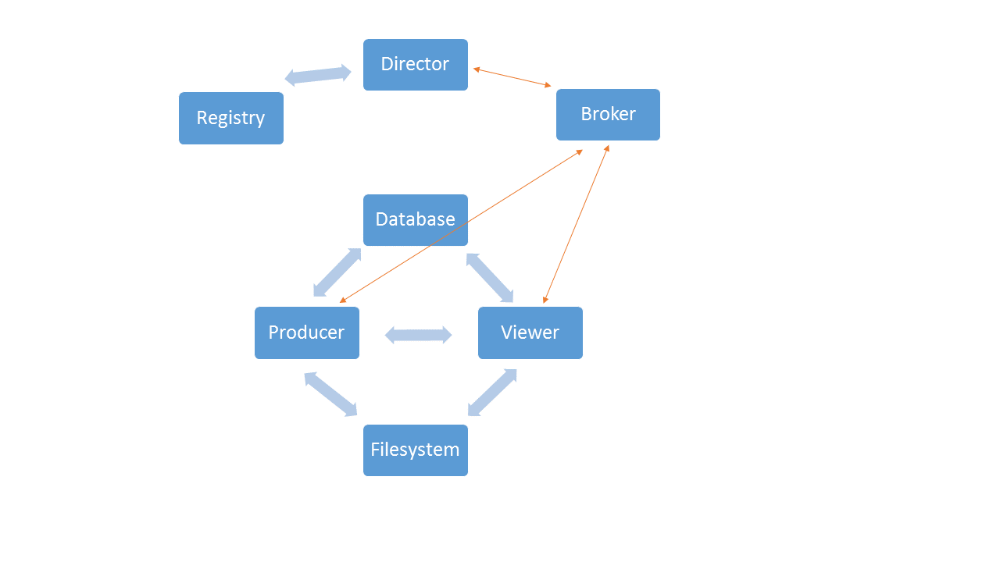

# Director: Organize computational services in simcore

Overview
========

Director is an experimental project for testing control/setup of a private docker registry and for testing different means of creating pipelines and communication/passing of data among them

Testing includes:
* setup of private registry with available computational services
* inter-service communication: JSON, thrift
* data passing via data service, synchronous, via database
* communication through manager
* docker container creation via manager from registry
* distributed containers vs. dynamic all-in-one container

Testing environment:
All tests involve a simple data producer service and a viewer that creates plotly views.

 Building Services
 =================
To build the director and producer/viewer services:

<code>
$ docker-compose up
</code>

To build the registry with frontend and nginx proxy see separate instruction file.

APIs and Documentation
======================
 
## Viewer service (port 5010)
 
This service is used to display data in plots.
 
Try `localhost:5010/plot_rest`
Try `localhost:5010/plot_db`
Try `localhost:5010/plot_mongo`
 
## Director service (port 8011) --> to be finished

Try `localhost:8010/plot_rabbit`

## rabbitmq

Try `http://localhost:15672`

## Registry frontend

Try `host:5001`

## Services organization:

