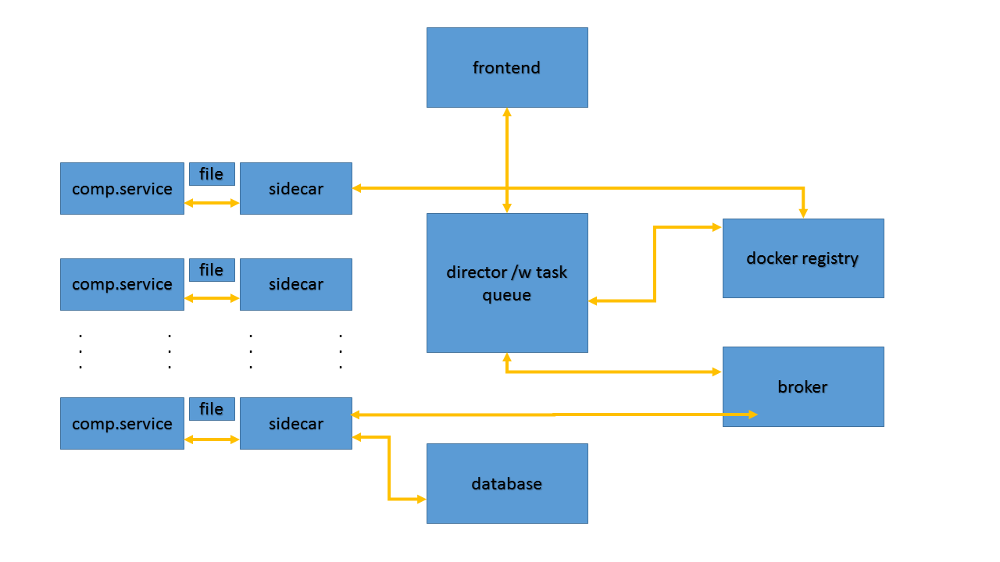

# Workflow

An experimental project for designing a complete workflow which includes pipeline extraction, job scheduling, result storage and display in the framework of a scalable docker swarm

## Description
The computational backend of simcore consists of a director that exposes all available services to the user via the frontend. It is also responsible to convert pipelines created by the user into inter-dependant jobs that can be scheduled asynchronously.
Scheduling is done using the python celery framework with rabbitMQ as a broker and MongoDB as a backend to store data. The celery workers are implemented as sidedcars that themselves can run on-shot docker containers with the actual compuational services. The full stack can be deployed in a docker swarm.

## Serivces, APIs and Documentation

### Director Service
Entry point for frontend

```
localhost:8010/run_pipeline (POST)
localhost:8010/calc/0.0/1.0/100/"sin(x)"
```
returns urls with job status and result

### Flower Service
Visualization of underlying celery task queue
```
localhost:5555
```

### Mongo Express
Visualization of underlying MongoDB

```
localhost:8081
```

### RabbitMQ
Visualization of broker
```
localhost:15672
```

### Visualizer
Visualization of docker swarm
```
localhost:5000
```

### Registry
Visualization of simcore docker registry
```
masu.speag.com:5001
```


### Pipeline descriptor
Example:
```
{
  "input": 
  [
    {
      "name": "N", 
      "value": 10
    }, 
    {
      "name": "xmin", 
      "value": -1.0
    }, 
    {
      "name": "xmax", 
      "value": 1.0
    },
    {
      "name": "func", 
      "value": "exp(x)*sin(x)"
    }
  ],
  "container":
  {
    "name": "masu.speag.com/comp.services/sidecar-solver",
    "tag": "1.1"
  }
}

```

### Orchestration diagram


